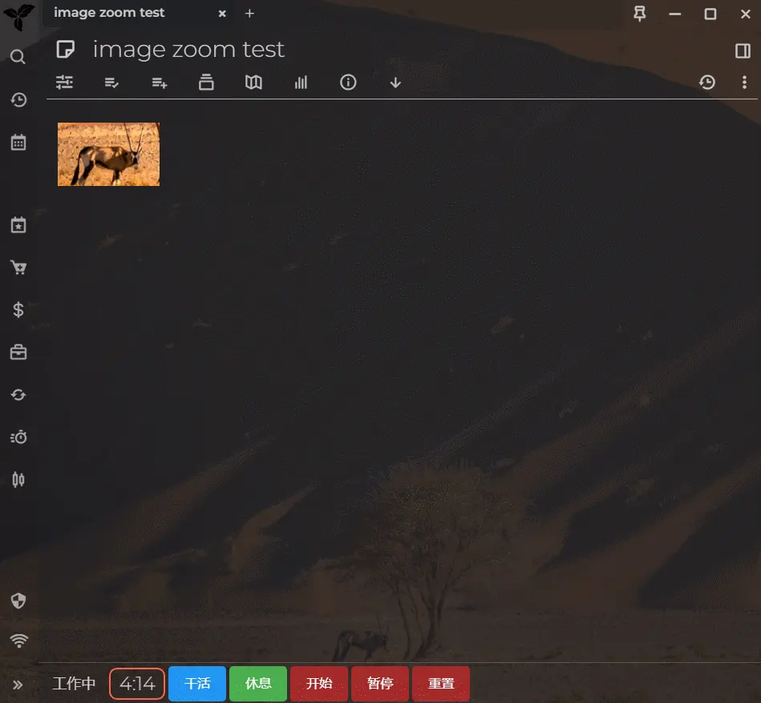

# image-zoom-widget for Trilium Notes :)

[中文说明](README_CN.md)

Please stand up and stretch your body for a while if you see this message :)

**Enhance Your Image Viewing Experience in Trilium**

This plugin brings advanced image preview functionality to Trilium Notes. Click on images to zoom them. You can zoom in and out with the mouse wheel, drag images around, and close the preview by clicking outside the image or pressing `Esc`.

# Screenshots

P.S. The theme used in the screenshot is  which is also made by me. You can have a try if you like it : )

# How to Install

1. Download the zip file from [release page](https://github.com/Nriver/image-zoom-widget/releases).
2. Right-click the note tree in Trilium and select *Import*, then uncheck `Safe Import`.
3. Restart Trilium Notes or press `ctrl+r` to reload the interface.
4. Open any note with images and click on them to see the zoom preview in a modal.
5. Enjoy zooming and dragging your images!

# Hints

1. Images will scale with the mouse wheel and can be dragged around in the preview modal.
2. Press `Esc` to exit the preview, or click outside the image to close it.
3. You can customize the zoom configuration in the `config` subnote.

# Why I Made This?

In Trilium Notes, images are an essential part of organizing visual content. However, Trilium lacks a native zoom feature for images, which can make it difficult to view details in high-resolution images. To enhance the image viewing experience, I created this plugin to provide smooth zooming, dragging, and closing functionalities.

I wanted to make it easier for users to interact with images directly within their notes without the need for external viewers or clunky workarounds.

This plugin is especially useful for people who regularly work with images in Trilium and want a more dynamic way to explore their content.

# Donation

If you appreciate this plugin, consider supporting me. Your contributions are highly appreciated!

Ko-fi:  

Alipay:  

Wechat Pay:  

