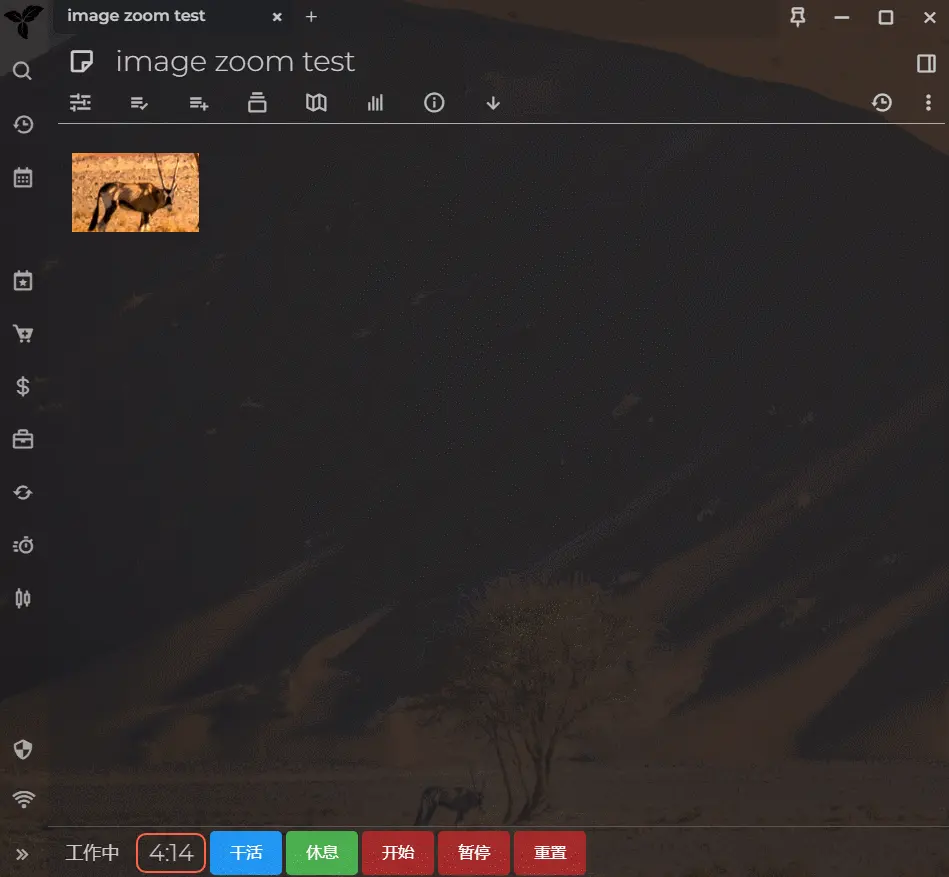

# image-zoom-widget for Trilium Notes :)

[English Version](README.md)

如果你看到这条信息，请站起来伸展一下身体 :)

**提升你在 Trilium 中查看图片的体验**

这个插件为 Trilium Notes 添加了高级的图片预览功能。你可以使用鼠标滚轮进行缩放，拖动图片，点击图片外的区域或按下 `Esc` 键关闭预览。

# 截图

P.S. 截图里的主题是我做的 , 喜欢的话可以试试 : )

# 如何安装

1. 从 [发布页面](https://github.com/Nriver/image-zoom-widget/releases) 下载 zip 文件。
2. 右键点击 Trilium 中的笔记树，选择 *导入*，然后取消勾选 `安全导入`。
3. 重启 Trilium Notes 或按 `ctrl+r` 重新加载界面。
4. 打开任何包含图片的笔记，点击图片即可查看缩放预览。
5. 享受缩放和拖动图片的乐趣！

# 使用提示

1. 预览窗口中的图片可以用鼠标滚轮缩放，并且可以拖动。
2. 按 `Esc` 键退出预览，或者点击图片外部区域关闭预览。
3. 你可以在 `config` 子笔记中自定义缩放配置。

# 为什么制作这个插件？

在 Trilium Notes 中，图片是组织视觉内容的重要组成部分。然而，Trilium 本身并不提供内置的图片缩放功能，这使得查看高清图像时有些困难。为了提升图片查看的体验，我创建了这个插件，提供平滑的缩放、拖动和关闭功能。

我希望用户可以直接在笔记中与图片进行交互，而不需要借助外部查看器或复杂的解决方法。

这个插件对那些在 Trilium 中频繁处理图片的用户特别有用，他们希望更灵活地浏览和操作图片内容。

# 捐赠

如果你喜欢这个插件，可以考虑支持我。感谢你的支持！

Ko-fi:  

支付宝：  

微信支付：  

